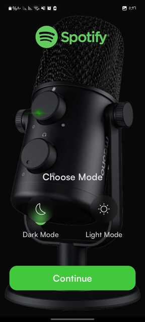
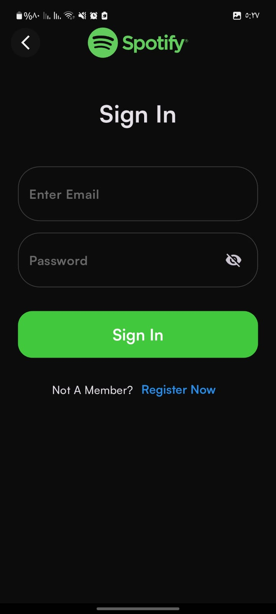
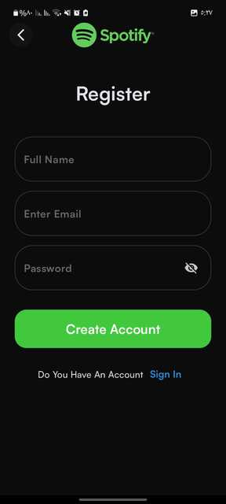
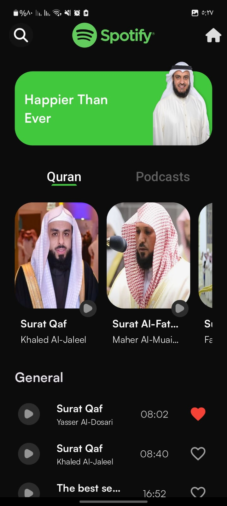
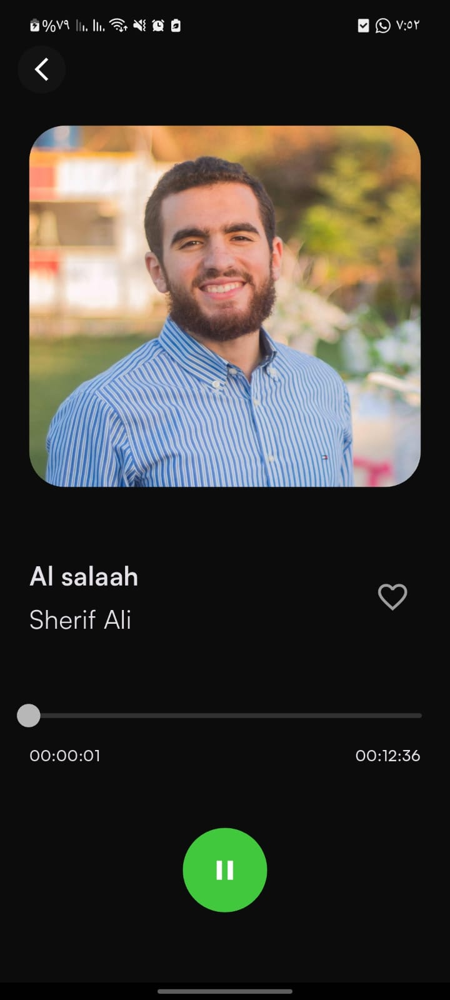
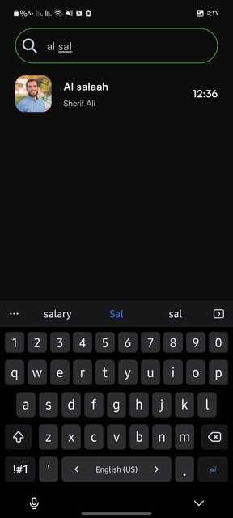
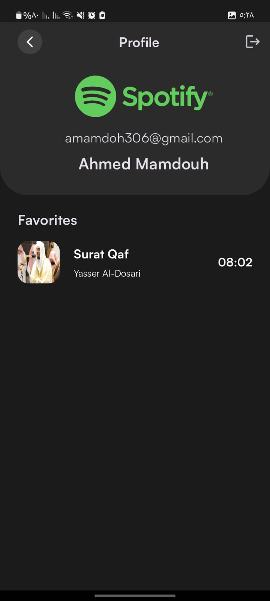
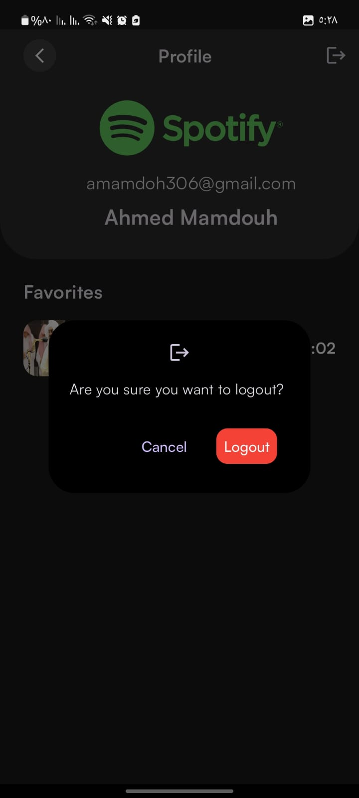

# Spotify App 🎵

A Flutter-based music player app that allows users to stream and manage their favorite records. The app features background playback, authentication, and seamless integration with Firebase for data storage.

## Features 🚀

- 🎶 **Audio Playback**: Play and control music using `just_audio` and `just_audio_background`.
- 🔄 **Background Playback**: Music continues playing even when the app is minimized.
- ❤️ **Favorites**: Users can mark records as favorites, which will be stored and displayed on their profile screen.
- 🔐 **Authentication**: Secure login and registration using Firebase Authentication with email and password.
- 🚪 **Logout Feature**: Users can log out from the profile screen with a confirmation dialog.
- 🛠 **MVVM, Cubit & Repository Pattern**: Well-structured architecture following MVVM, Cubit for state management, and Repository pattern for data handling.
- 🔍 **Search**: Search functionality to find records quickly.
- 🎨 **Splash Screen**: A custom splash screen using `flutter_native_splash`.
- ☁ **Firestore Integration**: Records and user data are stored in Firebase Firestore.
- 🌗 **Theme Changing**: Users can switch between light and dark themes, achieved using `hydrated_bloc`.
- 🔊 **Media Notification Support**: Background audio playback displays a media notification with controls using `just_audio_background`.

## Splash Screen 📱

custom splash screen using `flutter_native_splash` package:


## Theming Screen 🎨

Users can switch between **Dark Mode** and **Light Mode** during onboarding.

### Theme Selection Screen



## Authentication Feature 🔐

Users can securely log in and register using Firebase Authentication with email and password.

### Sign In Screen



### Registration Screen




## Home Screen 📱

The home screen of the app features various categories like Quran, Podcasts, and General music tracks. Below is a preview of the home screen:



## Playing Screen 🎵

Below is a preview of the "Playing" screen:



### Background Playback 🔄

Music continues playing even when the app is minimized, allowing users to enjoy their audio experience without interruption.


## Search Feature 🔍

The search screen allows users to find records efficiently. Below is a preview:



## Favorites Feature ❤️

Users can mark songs as favorites, and they will be displayed in the profile screen. Below is a preview of the profile screen:



## Logout Feature 🚪

Users can securely log out from the profile screen. When they tap the logout button, a confirmation dialog appears, asking if they are sure they want to log out. Upon confirmation, the user is signed out and redirected to the login screen.



## Project Structure 📂

The project follows a feature-based MVVM architecture, where each feature contains its own `data` (Repository, models, API/Firestore integration) and `presentation` (UI, Cubit) layers.

```
lib/
│── core/                  # Contains shared utilities and helpers  
│── features/              # Feature-based architecture  
│   ├── auth/              # Authentication feature  
│   │   ├── data/          # Repository, models, Firebase authentication  
│   │   ├── presentation/  # UI components, screens, and Cubit  
│   ├── splash/            # Splash screen feature  
│   │   ├── data/          # No external data, mainly configuration  
│   │   ├── presentation/  # Splash screen UI and Cubit  
│   ├── home/              # Home screen feature (fetching records, audio playback, search)  
│   │   ├── data/          # Repository, models, Firestore integration, audio handling  
│   │   ├── presentation/  # UI components, screens, and Cubit  
│── main.dart              # Entry point of the app  
```

## Repository Pattern 🏛

The app follows the **Repository pattern** to manage data flow between Firestore and the app. Each feature has its own repository inside the `data` folder, responsible for fetching and handling data.

Example: **Home Feature**

- `home_repository.dart` → Handles fetching records from Firestore and managing audio playback.
- `home_cubit.dart` → Manages the UI state based on repository data.
- `home_screen.dart` → Displays records and handles user interactions.

## Technologies Used 🛠

- Flutter
- Dart
- Firebase Authentication
- Firestore
- `just_audio` & `just_audio_background`
- `flutter_native_splash`
- Cubit (for state management)
- MVVM architecture
- Repository Pattern
- `hydrated_bloc` (for theme persistence)

## Installation 📥

1. Clone the repository:
   ```bash
   git clone https://github.com/your-repo/spotify-app.git
   ```
2. Navigate to the project directory:
   ```bash
   cd spotify-app
   ```
3. Install dependencies:
   ```bash
   flutter pub get
   ```
4. Run the app:
   ```bash
   flutter run
   ```

